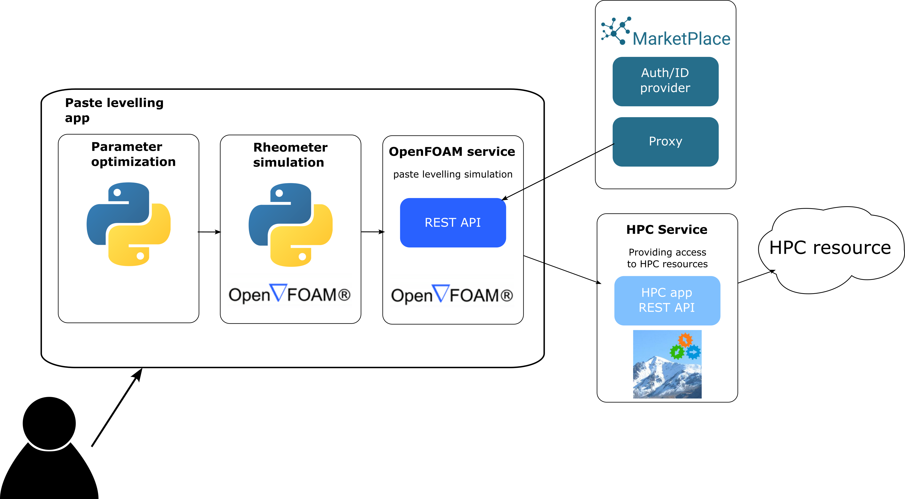

===========
Description
===========

Description of the workflow
===========================

.. _parameter_e:

1: Parameter estimation
-----------------------

Experimental rheometer data for a certain paste is taken as input for a parameter optimization script, 
which uses the Giesekus model equations to determine the constitutive properties required for the simulation. 

.. _rheometer:

2: Rheometer
------------

The second step is a simulation of the rheometer. The constitutive properties from the parameter optimization 
are used in an OpenFOAM simulation with rheotools, where the rheometer is simulated and the results are compared 
with the experimental data for validation of the obtained constitutive properties.

.. _paste_settling:

3: Paste settling
-----------------

Finally, the same constitutive properties are used for a full multiphase simulation of paste levelling, which is 
allowed to settle under gravity for the measurement of its spread.

Description of the app
======================

The Paste Levelling Application streamlines the workflow discussed in the previous section by automating 
the three steps without requiring any user input between them. The application is illustrated in the figure
below and is built using a series of Python modules to handle the different stages of the workflow.

The app consists internally in a series of Python modules which handle the different steps of the workflow. 

Parameter optimization
-----------------------
The first step, parameter optimization, generates the output with the constitutive properties used in the OpenFOAM 
simulations of both the rheometer and levelling steps. 

Rheometer simulations
---------------------
The rheometer simulations are performed using a Python script that carries out a series of OpenFOAM simulations over the required 
range of frequencies and amplitudes to replicate the experimental rheometer data. 
In this step, we evaluate the ability of the Giesekus model, with parameters obtained in the previous step, to reproduce paste moduli and viscosity.

Simulation
----------

Finally, the levelling simulation is a pre-prepared OpenFOAM case setup that requires only the appropriate constitutive properties to run.
This step uses a REST API to communicate with the MarketPlace platform and the HPC app, which handles the parallel remote job. 

The graphical user interface is handled via Flask, a Python-based web application framework. 