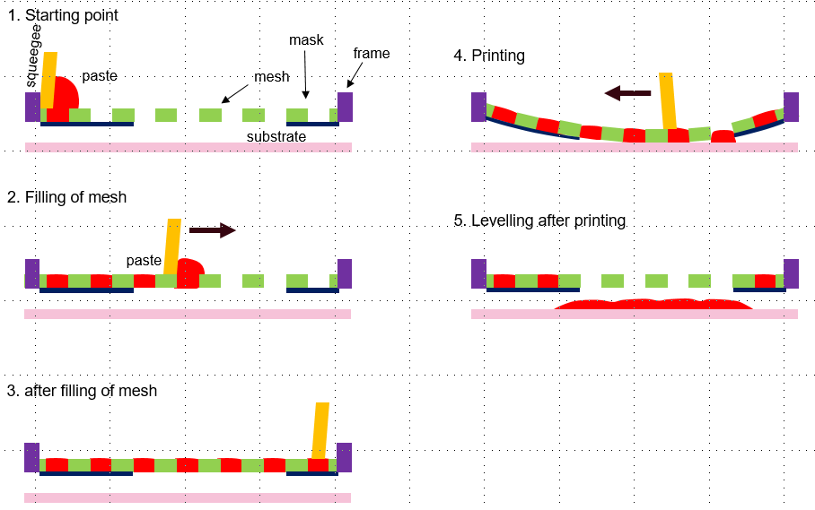

MarketPlace Use Case 2 documentation
====================================

Use case 2 consists of the simulation of viscoelastic pastes used in screen printing for solid oxide fuel cells. 
The entire screen-printing process is shown in Figure  

Due to the complexity of the viscoelastic material, 
with its highly non-linear behaviour, and the high computational cost required to simulate each individual step in the process, 
the app focus exclusively on the levelling stage of the screen printing process.

The levelling stage is important to determine the final quality of the printing as the paste spread is an important parameter. 

Paste spread is also highly dependent on paste properties, so a simulation of the levelling process is also ideal for testing 
different pastes and defining their optimal properties with minimal experimentation.

the Paste Levelling App takes as input files with the experimental rheometer data for 
different pastes and provides a measure of the paste broadening. It also provides intermediate output in the 
form of comparison plots between experimental and simulation rheometer data.

Check out the :doc:`usage` section for further information.

.. note::

   This project is under active development.

Contents
--------

.. toctree::
   description
   usage

