=====
Usage
=====
When you open the app you will be presented by the following screen

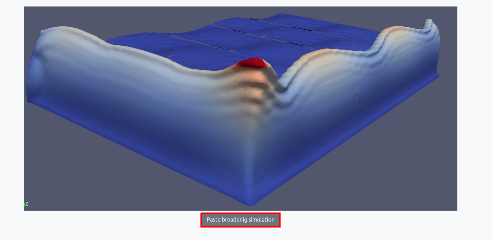

To begin using the app,  click on the "Paste broadening simulation" button.

Preparation
===========

You will be presented the app interface where you can enter all the quantity you need for your case.

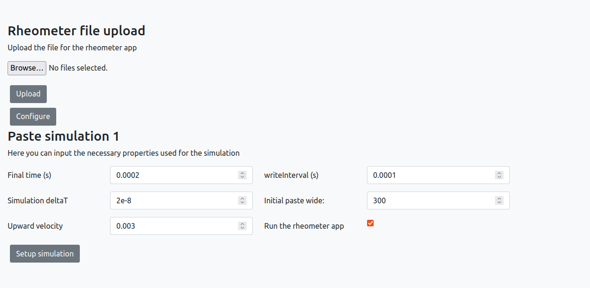

-Loading experimental data 
----------------------------
The first step is to upload the experimental data in the upper part of the screen and click on Configure 

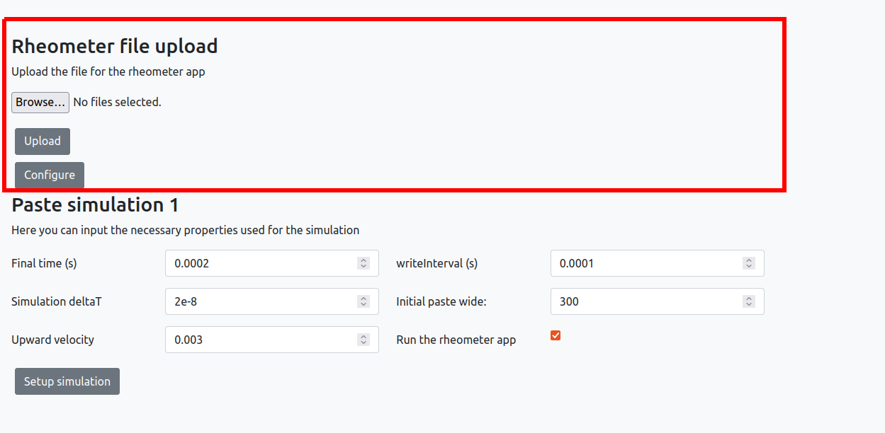

-Simulation parameters
-------------------------
In the lower part of the screen you need to define the simulation parameters. 

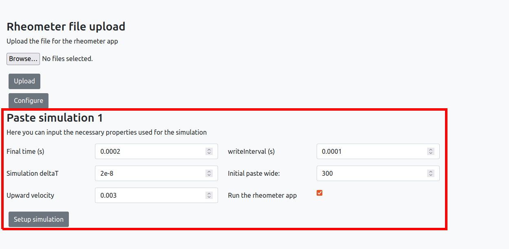

The parameters are described in more detail below:

* **Final time**: This parameter sets the duration of the simulation, starting from time 0. The simulation will run until the final time is reached.
* **Simulation deltaT**: his parameter sets the time step used in the simulation. A smaller time step will result in a more accurate simulation, but will require more computational resources.
* **Upward velocity**: This parameter sets the upward velocity induced by the grid being lifted. The velocity is depicted in the figure below, and is a key factor in the rheometer simulation.
* **writeinterval**: This parameter determines how often the simulation values will be saved. It must be larger than the time step.
* **Initial paste wide**: This parameter sets the initial size of the deposed paste. This is also depicted in the figure below, and is an important input for the simulation..
* **Run the rheometer app**: This option determines whether or not to run the parameter estimation and rheometer steps of the application. If left unchecked, the paste broadening app will run with default values.

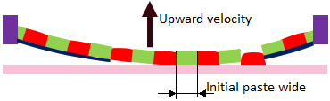
   
Once everything is set, you can click on the `Setup simulation` button.

Running
=======

A screen summarizing the simulation settings will appear, along with an option to run the simulation:

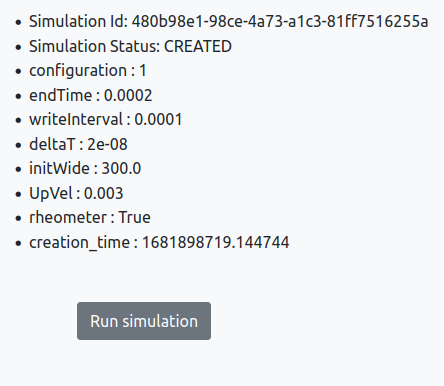

when you click on the *Run simulation*, you will see the *Simulation Status* change from *CREATED* to *INPROGRESS*

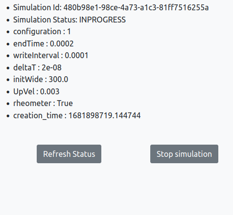

click on the *Refresh status* button, until the *Simulation Status* change from *INPROGRESS* to *COMPLETED*, 

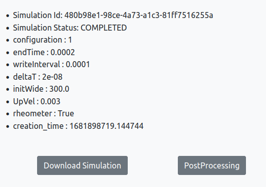

Results
=======
When a simulation is completed you will be offered two option, *Dowload Simulation* or *Postprocessing*

-Download results
-------------------------
If you click on *Dowload Simulation*, you will see the screen below, which allows you to dowload the simualtion data and results.

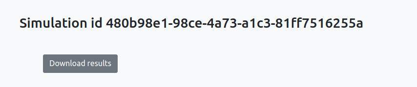

-Postprocessing
-------------------------
To access the default post-processed results, simply click on the "Postprocessing" button, as shown in the image below.

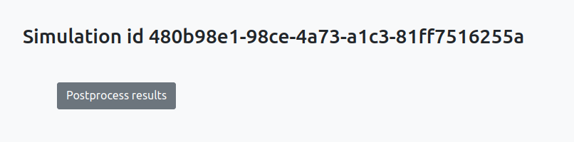

Once you've clicked on "Postprocess results," you will see a screen that looks similar to the one below:

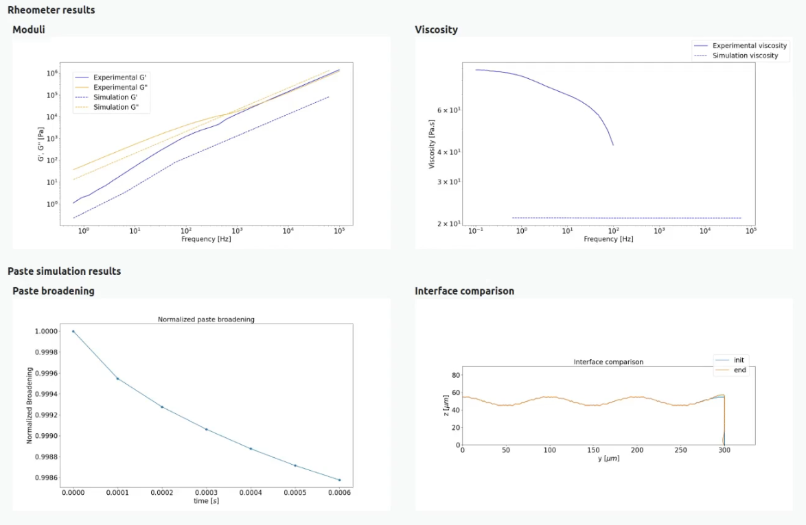

The resulting plots are described in more detail below:

* **Rheometer results** This section shows a comparison between numerical and  experimental rheometer data
   * **Moduli**: This plot compares G' and G''.    
   * **Viscosity**: This plot compares viscosity.

* **Paste simulation results**: This section displays the results from simulation.
   * **Paste broadening**: This plot shows the time evolution of the normalized paste broadening, which is calculated by dividing the paste width at time t by the initial width value.
   * **Interface comparison**: This plot compares the initial interface, with the interface at the end of the simulation.
